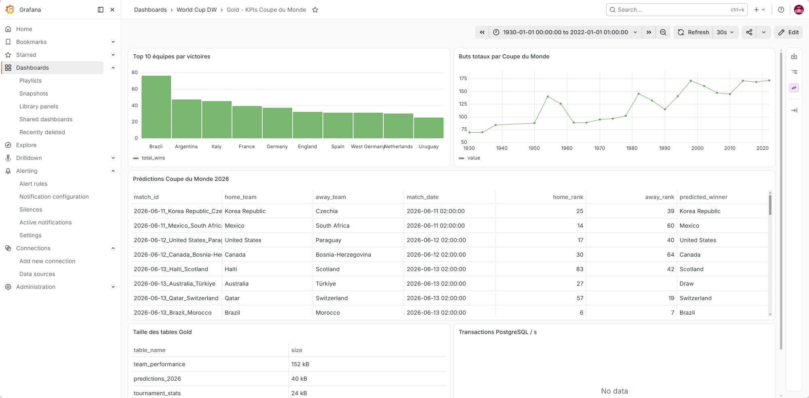
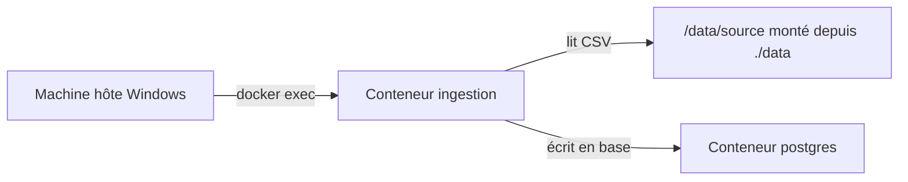

# DEMO



# World Cup Data Warehouse

Projet de mise en place d'un Data Warehouse pour analyser les données historiques des Coupes du Monde de la FIFA et le calendrier 2026.

## Structure du projet
- `data/source/` : Fichiers CSV contenant les données brutes (classements FIFA, historique des compétitions, calendrier 2026, détails des matchs de 1930 à 2022).
- `ingestion/` : Script SQL pour l'initialisation de la base de données brute (schéma public).
- `transformation/` : Script SQL pour le nettoyage et le typage des données vers la zone intermédiaire (schéma silver).
- `docker-compose.yml` : Fichier de configuration du service de base de données PostgreSQL.

## Prérequis
- Docker
- Docker Compose

## Ingestion et ETL (Transition vers Python / Spark)

Afin de pouvoir traiter des flux complexes et préparer la transition vers **Apache Spark** pour les transformations et l'ETL de données massives, j'ai modifié la méthode d'ingestion. Plutôt que d'utiliser des scripts SQL d'import bruts (`init.sql`), j'utilise désormais un script Python (`csv_to_postgres.py`) s'exécutant dans un conteneur dédié à l'ingestion.

### Architecture d'ingestion



### Lancement avec docker-compose.1worker.yml

Le conteneur `ingestion` exécute réellement le script Python pour charger les fichiers CSV sources vers la base de données PostgreSQL dans le schéma `bronze`.

Pour lancer l'ensemble des services :
```bash
docker compose -f docker-compose.1worker.yml up -d --build
```

Pour exécuter manuellement l'ingestion dans le conteneur `ingestion` (si nécessaire) :
```bash
docker exec -it worldcup_ingestion python ingestion/csv_to_postgres.py
```

## Transformation (Zone Silver)
Pour nettoyer, filtrer et typer les données brutes :
```bash
Get-Content transformation/silver.sql -Raw | docker exec -i worldcup_db psql -U postgres -d worldcup_dw
```
Cette étape produit les tables typées suivantes dans le schéma `silver` :
- `silver.fifa_rankings` (fusion des classements 2022 et 2026)
- `silver.world_cup_history`
- `silver.schedule_2026`
- `silver.matches`
